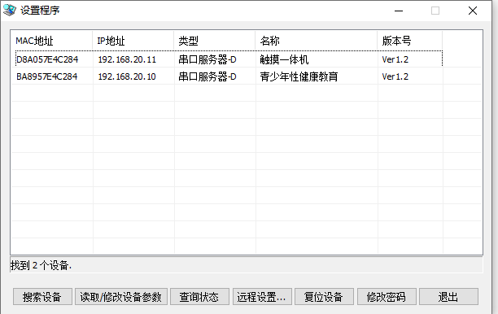

# 中控软件
控制展厅内部硬件设备开关

# 多媒体服务器
**1. 硬件模块：**

淘宝北方互动工作室PCIE-1X 网络开关机卡

**2. 硬件配置：**

将PICE卡插到受控主机主板上开机，并且用网线连接交换机。同时将中控主机与交换机用网线连接。

打开设置程序.exe 见百度云链接 

1、点击搜索设备；

2、选取设备并且点击读取/修改设备参数；3、ip地址修改为20网段，如：（192.168.20.11），子网掩码255.255.0.0 ；4、工作模式设置成TCP服务器，端口3000；

将中控主机子网掩码设置成255.255.0.0

# LED电箱
1. 硬件模块：
# 灯光开关
1. 硬件模块：
# 中控软件配置

